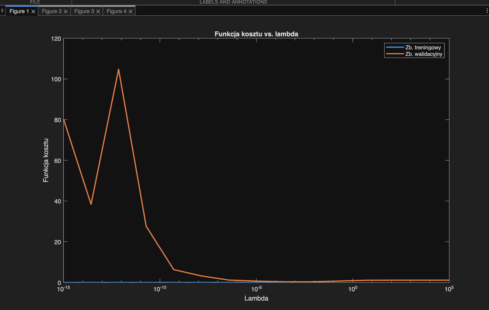
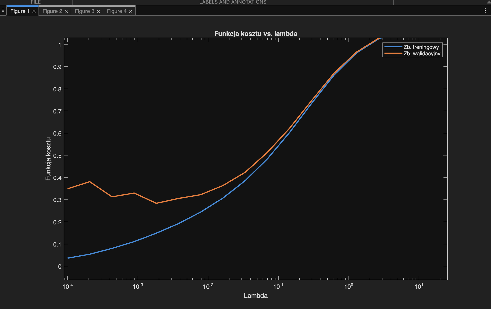
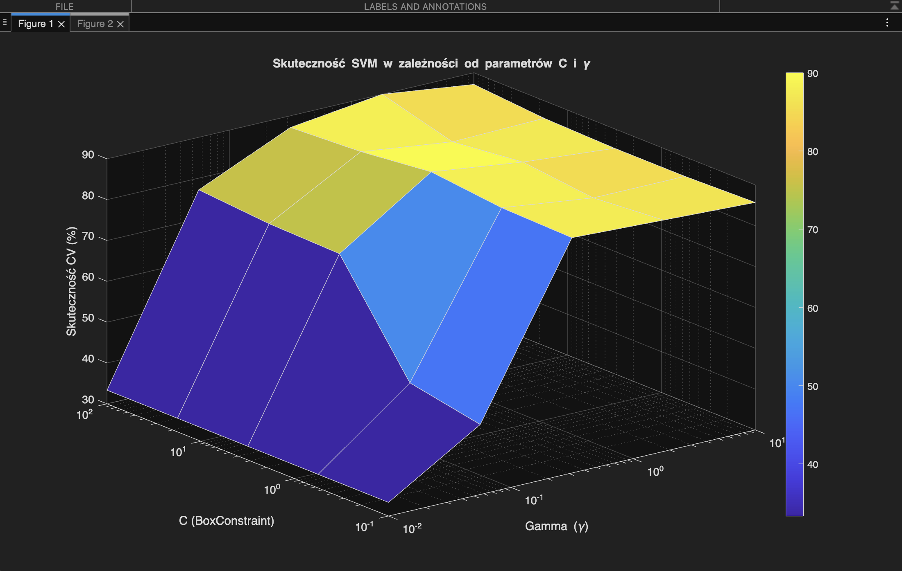
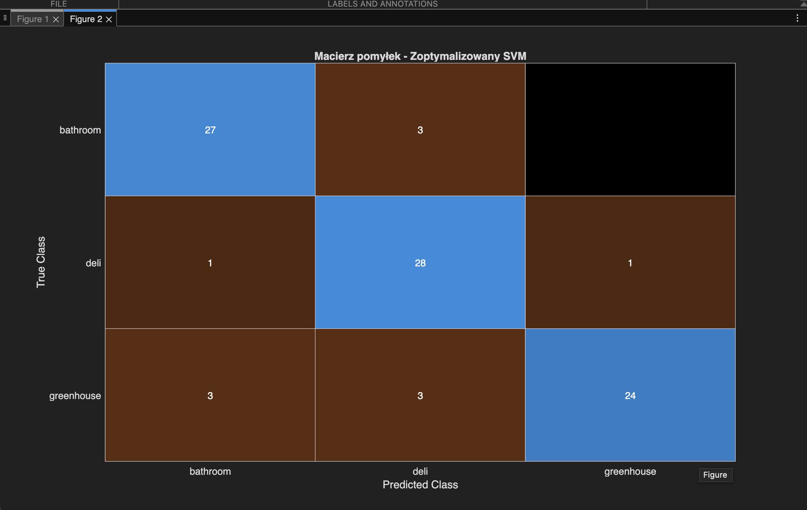

## TWM LAB3 
## Raport z Laboratoriów 3 
* **Bartosz Zaborowski 319996**
* **Piotr Walczak 315220**


## Część 1

### Zadanie 1

Otrzymaliśmy następujące wyniki po uruchomieniu skryptu zadania 1:

```

Local minimum found.

Optimization completed because the size of the gradient is less than
the value of the optimality tolerance.

<stopping criteria details>
Accuracy train: 100.000000
Accuracy test: 85.555556
>> 

```

Model regresji logistycznej osiągnął skuteczność 100% na zbiorze uczącym oraz 85.56% na zbiorze testowym. Oznacza to, że model bardzo dobrze dopasował się do danych treningowych, jednak jego skuteczność na nowych danych jest niższa, co wskazuje na lekkie przeuczenie. Mimo tego model zachowuje dobrą zdolność generalizacji i poprawnie klasyfikuje większość obrazów.


### Zadanie 2

Po uruchomieniu skryptu do zadania 2 otrzymujemy medzy innymi nastepujace wytkresy:


Po przeanalizowaniu wykresów oraz po przeprowadzeniu eksperymentów, dochodzimy do wniosku, że wraz ze wzrostem liczby cech funkcja kosztu dla zbioru uczącego stale maleje, a skuteczność dąży do 100%. Skuteczność treningowa dociera do 100%, podczas gdy walidacyjna po osiągnięciu około 85% przy kilkunastu cechach zaczyna falować, a dystans między obiema liniami staje się ogromny. Dla zbioru walidacyjnego funkcja kosztu osiąga minimum dla 14 cech, po czym gwałtownie rośnie, co świadczy o silnym przeuczeniu modelu przy zbyt dużej liczbie wymiarów (spadek zdolności generalizacji). W związku z tym optymalnym wyborem dla tego scenariusza jest ograniczenie modelu do 14 cech.

Generowane były również wykresy odchylenia standardowego:


Analiza wykresów odchylenia standardowego potwierdziła zjawisko przeuczenia. Podczas gdy dla zbioru uczącego odchylenie jest niemal zerowe (model jest stabilny), na zbiorze walidacyjnym po przekroczeniu 14 cech obserwujemy drastyczny wzrost niestabilności (ogromne skoki wariancji funkcji kosztu). Potwierdza to ogromnej wrażliwości przeuczonego modelu na to, jak dokładnie podzielono dane.


### Zadanie 3

Po wykonaniu skryptu do zadania 3 otrzymujemy następujące wykresy:


Widzimy, że wraz ze wzrostem ilości danych wykresy funkcji kosztu zbiegają się, błąd treningowy rośnie, a walidacyjny maleje. Wynika to z faktu, że na małym zbiorze model łatwo uczy się obrazków na pamięć, natomiast duża ilość danych zmusza go do szukania ogólnych, uniwersalnych reguł (co potwierdza też spadające odchylenie standardowe). Ostatecznie jednak niska skuteczność i wysoki koszt końcowy wskazują na zjawisko niedouczenia. Model bazujący 5 cechach jest zbyt prosty, by w pełni skorzystać z dużej liczby obrazków.


### Zadanie 4

Po uruchomieniu skryptu dla zadania 4 otrzymaliśmy nastepujace wykresy:


Z analizy wykresu funkcji kosztu jasno wynika, że optymalnym momentem na wczesne zatrzymanie jest około 28 iteracja. To w tym punkcie błąd walidacyjny osiąga minimum, po czym zaczyna rosnąć, co sugeruje zjawisko przeuczenia modelu. Przerwanie nauki w tej iteracji pozwala na zachowanie najlepszej zdolności do generalizacji, co przełożyło się na skuteczność rzędu 85.5% na zbiorze testowym.


### Zadanie 5 

Po uruchomieniu skryptu otrzymalismy miedzy innymi wykres funkcji kosztu w stosunku do lambdy:




W celu dokładnej lokalizacji optymalnego współczynnika regularyzacji, zagęszczono siatkę przeszukiwania do przedziału od 10^−4 do 10^2. Wykres zmienił się w następujący sposób:



 Na podstawie analizy wykresów, a w szczególności poszukując globalnego minimum funkcji kosztu dla zbioru walidacyjnego, wybraliśmy jako optymalny parametr λ = 0.0025. Taka wartość regularyzacji optymalnie karze model za zbyt duże wagi, uodparniając go na przeuczenie, a jednocześnie nie prowadzi do zjawiska niedouczenia.


 ### Zadanie 6

Po ponownym wytrenowaniu modelu na pełnym zbiorze uczącym z użyciem optymalnego współczynnika regularyzacji (λ=0.0025), klasyfikator osiągnął 97.14% skuteczności treningowej oraz 86.67% skuteczności testowej. Możemy zauważyć, że spadek skuteczności na zbiorze treningowym przyniósł pożądaną korzyść, w postaci najwyższego dotąd wyniku na zbiorze testowym. Udowadnia to, że regularyzacja L2 z odpowiednio dobranym parametrem skutecznie ograniczyła przeuczenie i poprawiła zdolność modelu do uogólniania wiedzy na nowych danych.


## Część 2 - SVM

Otrzymane przez nas wyniki działania skryptu:

```
Najlepsze parametry: C = 3.162, Gamma = 0.316
Skuteczność walidacyjna (CV) = 90.00%

Wyniki na zbiorze testowym:
Mikro-uśredniona skuteczność (Micro-Accuracy): 87.78%
Makro-uśredniona skuteczność (Macro-Accuracy): 87.78%

Porównanie: Rozpoczynam automatyczną optymalizację MATLABa...
Skuteczność na teście (Auto-optymalizacja): 87.78%
```


Przeprowadziliśmy przeszukiwanie siatki (Grid Search) z zastosowaniem 5-krotnej walidacji krzyżowej, co pozwoliło na identyfikację optymalnych parametrów dla wieloklasowego klasyfikatora SVM z jądrem Gaussa. 



Uzyskane przez nas wyniki i hiperparametry:
* Optymalne parametry modelu: $C = 3.162$ oraz $\gamma = 0.316$
* Skuteczność w kroswalidacji (CV): 90.00%
* Mikro-uśredniona skuteczność (zb. testowy): 87.78%
* Makro-uśredniona skuteczność (zb. testowy): 87.78%

Na niezależnym zbiorze testowym zoptymalizowany model uzyskał bardzo dobrą skuteczność na poziomie 87.78%. Wartości mikro i makro uśrednione są ze sobą identyczne, co jest bezpośrednim wynikiem idealnego zbalansowania klas w zbiorze testowym (dokładnie po 30 próbek na każdą klasę). 



Po przeanalizowaniu macierzy pomyłek doszliśmy do wniosku, że największe trudności sprawiało algorytmowi poprawne sklasyfikowanie obiektów z klasy greenhouse (największe rozproszenie błędów pomiędzy pozostałe klasy), podczas gdy deli oraz bathroom były rozpoznawane z wyższą pewnością. Co istotne, zaimplementowany w ramach zadania proces strojenia parametrów (Grid Search) dał odrobinę lepszy rezultat niż wbudowane narzędzie auto-optymalizacji środowiska MATLAB (85.56%), co udowadnia skuteczność i zasadność ręcznego przeszukiwania przestrzeni hiperparametrów.